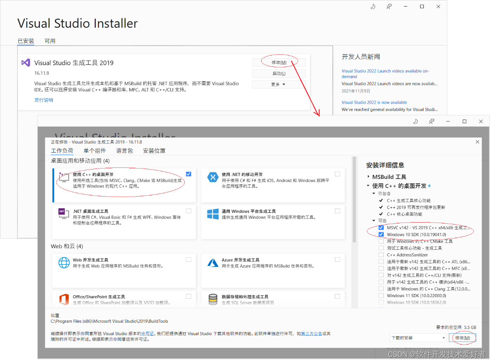

<div align="center">

<a href="https://moegirl.org.cn/苏半夏">
  <picture>
    <source media="(prefers-color-scheme: dark)" srcset="Picture/苏半夏D.png">
    
  </picture>
</a>

# TRSS Yunzai Plugin

云崽机器人插件

[](https://github.com/TimeRainStarSky/TRSS-Plugin)
[](../../stargazers)
[](Install.sh)
[](../../releases/latest)

[](https://github.com/TimeRainStarSky/TRSS-Plugin)

</div>

## 安装教程

- 推荐使用 [TRSS Yunzai 管理脚本](https://TRSS.me) 安装

[](../../../TRSS_Yunzai)

1. 准备：[Yunzai-Bot](https://github.com/Le-niao/Yunzai-Bot)

2. 安装：[GitHub](https://github.com/TimeRainStarSky/TRSS-Plugin) 或 [Gitee](https://gitee.com/TimeRainStarSky/TRSS-Plugin)

```
git clone --depth 1 https://Yunzai.TRSS.me plugins/TRSS-Plugin
pnpm i
```

3. 安装 `图片修复` | `图片背景去除` | `语音合成`，不用可忽略

<details><summary>展开</summary>

安装 [Python 3.10-3.11](https://python.org) 和 [Poetry](https://python-poetry.org)，并在插件目录执行以下操作

```
poetry install
```

- 图片修复：

```
git clone --depth 1 https://gitee.com/TimeRainStarSky/Real-ESRGAN
cd Real-ESRGAN
poetry run python setup.py develop
```

- 图片背景去除：

```
git clone --depth 1 https://gitee.com/TimeRainStarSky/RemBG
cd RemBG
curl -LO https://github.com/TimeRainStarSky/TRSS-Plugin/releases/download/latest/u2net.onnx.xz
curl -LO https://github.com/TimeRainStarSky/TRSS-Plugin/releases/download/latest/isnetis.onnx.xz
xz -dv u2net.onnx.xz isnetis.onnx.xz
```

- 语音合成：

```
poetry run pip install monotonic-align
git clone --depth 1 https://gitee.com/TimeRainStarSky/ChatWaifu
git clone --depth 1 https://gitee.com/TimeRainStarSky/GenshinVoice
```

- 语音合成 汉语模型：

```
cd ChatWaifu
curl -LO https://github.com/TimeRainStarSky/TRSS-Plugin/releases/download/latest/ChatWaifuCN.txz
tar -xvJf ChatWaifuCN.txz
```

- 语音合成 日语模型：

```
cd ChatWaifu
curl -LO https://github.com/TimeRainStarSky/TRSS-Plugin/releases/download/latest/ChatWaifuJP.txz
tar -xvJf ChatWaifuJP.txz
```

- 语音合成 原神模型：
```
cd GenshinVoice
curl -LO https://github.com/TimeRainStarSky/TRSS-Plugin/releases/download/latest/G_809000.pth.xz
xz -dv G_809000.pth.xz
```

<details><summary>部署为 API 服务器</summary>

```
bash server.sh [端口]
```

</details>

- 阿里云盘 / 百度网盘：

使用脚本安装后，启动 CLI，输入 `login -h`，按提示登录

</details>

## 使用教程

<details><summary>图片修复</summary>

- 图片修复 / 动漫图片修复 + `图片`

</details>

<details><summary>图片背景去除</summary>

- 图片背景去除 / 动漫图片背景去除 + `图片`

</details>

<details><summary>语音合成</summary>

- `角色名` + 说 + `中文`
- 语音合成角色列表

</details>

<details><summary>系统信息</summary>

- 系统信息 / 系统信息图片 / 系统测试

</details>

<details><summary>二维码生成</summary>

- 二维码 + `文字`

</details>

<details><summary>米哈游登录</summary>

- 二维码登录：米哈游登录
- 账号密码登录：米哈游登录 + `账号`

</details>

<details><summary>Markdown（权限：主人）</summary>

- md + `文件` / `URL`

</details>

<details><summary>代码高亮（权限：主人）</summary>

- sc + `文件` / `URL`

</details>

<details><summary>远程命令（权限：主人）</summary>

- rc / rcp / rcj / rcjp / dm / mm / fm + `命令`

</details>

<details><summary>文件操作（权限：主人）</summary>

- 文件查看 / 文件上传 / 文件下载 + `路径`

</details>

<details><summary>阿里云盘（权限：主人）</summary>

阿里云盘 +

- 帮助
- 上传
- 下载
- 相簿
- 链接
- 查看
- 创建目录
- 移动
- 回收站
- 重命名
- 删除
- 分享
- 同步备份
- 树形图
- 在线网盘
- 切换网盘
- 登录账号
- 账号列表
- 退出账号
- 空间配额
- 切换账号
- 当前账号

</details>

<details><summary>百度网盘（权限：主人）</summary>

百度网盘 +

- 帮助
- 上传
- 下载
- 复制
- 链接
- 查看
- 元信息
- 创建目录
- 移动
- 离线下载
- 空间配额
- 回收站
- 删除
- 搜索
- 分享
- 转存
- 树形图
- 登录账号
- 账号列表
- 退出账号
- 切换账号
- 当前账号

</details>

## 常见问题

<details><summary>展开</summary>

- 问：`ModuleNotFoundError: No module named 'xxx'`
- 答：未正确执行 `poetry install`

- 问：`已杀死` | `Signal 9` | `MemoryError`
- 答：`清理内存` 或 `增加 SWAP`

- 问：使用 `Git Bash` 执行 `poetry install` 失败
- 答：改用 `命令提示符` 或 `Windows PowerShell`

- 问：`error: Microsoft Visual C++ 14.0 or greater is required.`
- 答：下载安装 [Microsoft C++ 生成工具](https://visualstudio.microsoft.com/zh-hans/visual-cpp-build-tools)


- 问：`'bash' 不是内部或外部命令，也不是可运行的程序或批处理文件` `bash : 无法将“sh”项识别为 cmdlet、函数、脚本文件或可运行程序的名称。请检查名称的拼写，如果包括路径，请确保路径正确，然后再试一次。`
- 答：改用 `Git Bash`

- 问：手动安装过程中出现问题
- 答：建议自行解决，不会就用脚本一键安装

- 问：我有其他问题
- 答：提供详细问题描述，通过下方 联系方式 反馈问题

</details>

## 联系方式

- QQ 群组：
1. [659945190](https://jq.qq.com/?k=VBuHGPv3)
2. [1027131254](https://jq.qq.com/?k=Af0pTDHU)
3. [300714227](https://jq.qq.com/?k=V2xVpaR7)

### 时雨 🌌 星空

- GitHub：[TimeRainStarSky](https://github.com/TimeRainStarSky)
- 酷安：[时雨丶星空](https://coolapk.com/u/2650948)
- QQ：[2536554304](https://qm.qq.com/cgi-bin/qm/qr?k=x8LtlP8vwZs7qLwmsbCsyLoAHy7Et1Pj)
- Telegram：[TimeRainStarSky](https://t.me/TimeRainStarSky)

## 赞助支持

- 爱发电：<https://afdian.net/a/TimeRainStarSky>
- Partme：<https://partme.com/TimeRainStarSky>